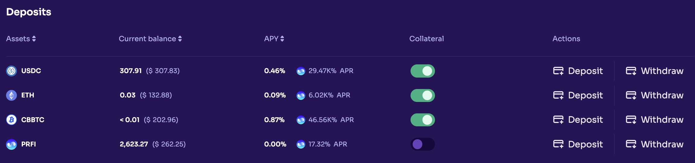

# Loan Repayment

The repayment period for loans is indefinite as long as the position remains secure. Nevertheless, fees associated with the loan accumulate over time, diminishing the Health Factor (unless addressed by the user), which could potentially lead to liquidation.

Repayment of loans must be made using the same asset that was borrowed. For instance, if 1 Ethereum was borrowed, repayment requires 1 ETH along with accrued fees to settle the loan.

To initiate loan repayment, navigate to the Dashboard and, scroll down until find the Borrows section, click on "Repay" for the desired asset.

<figure><figcaption></figcaption></figure>

This action will prompt the display of a "Repay" section specific to the chosen asset. Within this section, you can review details such as your borrowed amount, wallet balance, and Health Factor. Choose the repayment amount for the loan and click "Continue" to confirm the transaction.

<figure><figcaption></figcaption></figure>
