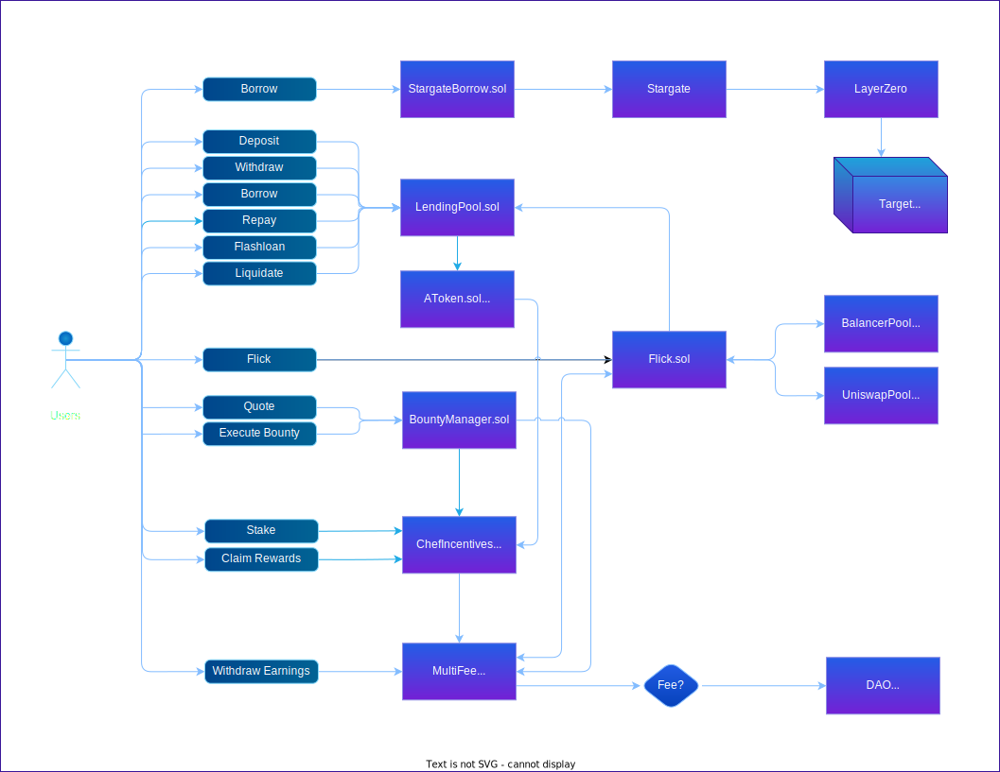

# Contracts

_Smart contracts will be available on the mainnet following the completion of audits._

**This section gives a global overview of the PrimeFi smart contracts and how they interact with each other.**

Please note that the actual interactions are much more complicated and numerous. It is not the intention of this diagram to list them all, but merly to give an overview of the actors, contracts and interactions involved. A more detailed chronicle of these interactions can be found in the following subsections:

- [Lending & Borrowing](contracts/lending-borrowing.md)
- [Staking](contracts/staking.md)

