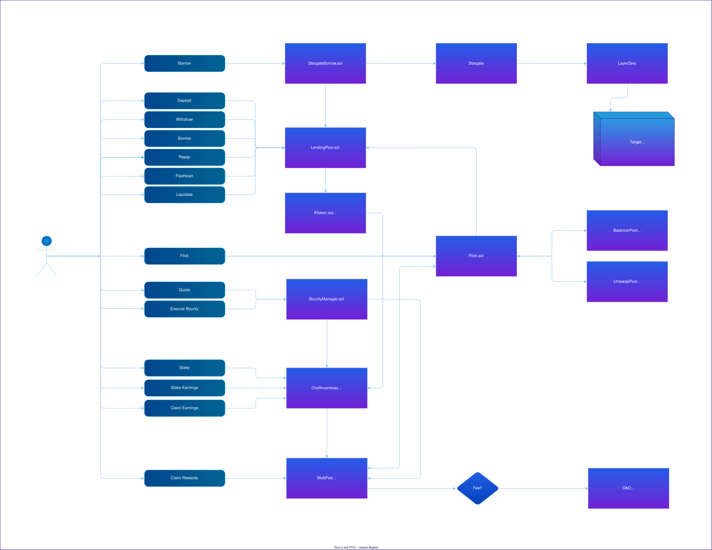

# Contracts

**This section gives a global overview of the PrimeFi smart contracts and how they interact with each other.** Deployment addresses for Base, HyperEVM and XDC are listed under [Smart Contracts Addresses](smart-contracts-addresses/README.md). Check [Market Status](security/market-status.md) separately for current availability or operational restrictions.

Please note that the actual interactions are much more complicated and numerous. It is not the intention of this diagram to list them all, but merely to give an overview of the actors, contracts and interactions involved. A more detailed chronicle of these interactions can be found in the following subsections:

* [Lending & Borrowing](contracts/lending-borrowing.md)
* [Staking](contracts/stake.md)

