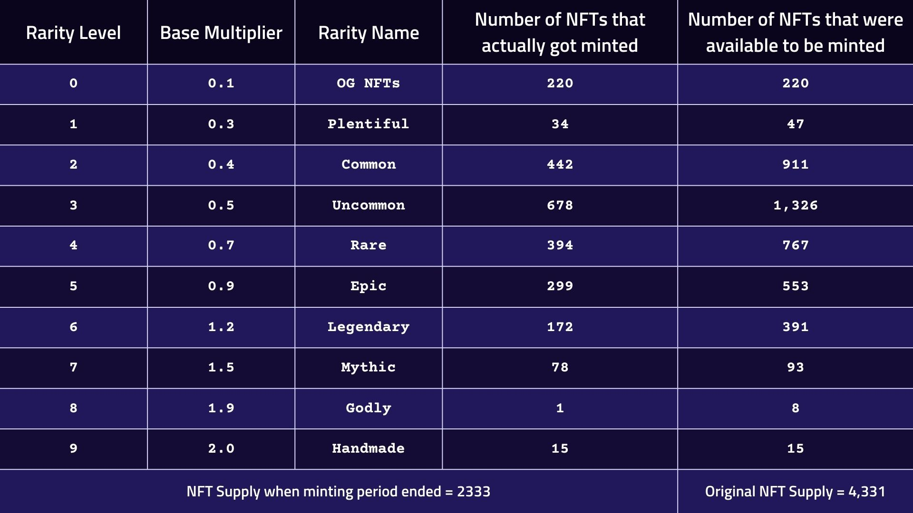

# Staking Mechanics

The live staking flow lets users deposit PRFI tokens into a PRFI NFT and participate in configured reward distributions. Leveling up changes the NFT's reward weighting; it does not guarantee rewards or an increase in the NFT's market value. This flow is separate from the planned use of NFTs as lending collateral.

***

## How It Works

### 1. Stake PRFI

Deposit PRFI tokens into your NFT. This increases the NFT's level and activates its reward multiplier under the current staking configuration.

### 2. Participate in Rewards

Qualifying NFTs may receive distributions from multiple sources:

| Source                | Description                                             |
| --------------------- | ------------------------------------------------------- |
| **PRFI Rewards Pool** | Published schedule at the time of writing: 100,000 PRFI per month across qualifying staked NFTs |
| **NFT Royalties**     | Eligible share of PrimePort marketplace royalties under current terms |
| **PrimeFi profit sharing** | Planned component; not documented as an active on-chain distribution |

A future concept has been described as allocating 40% of PrimeFi lending-and-borrowing protocol profits to qualifying PRFI NFT participants. Treat it as **planned and inactive** until an activation notice, precise terms, distribution contract, and verifiable on-chain configuration are published. Live staking rewards and claimable amounts can change; no payout, APR, or yield is guaranteed.

### 3. Level Up

As you stake more PRFI, your NFT progresses through levels (1–20). Each level increases the **added multiplier**, boosting your share of the reward pool.

***

## Multiplier System

| Component            | Description                                 |
| -------------------- | ------------------------------------------- |
| **Base Multiplier**  | Set by the NFT's rarity tier (fixed)        |
| **Added Multiplier** | Increases as the NFT levels up (1–20)       |
| **Total Multiplier** | Base + Added - determines your reward share |

<figure><figcaption></figcaption></figure>

<figure><figcaption></figcaption></figure>

***

## Interface Actions

| Action             | Description                                                                                                                         |
| ------------------ | ----------------------------------------------------------------------------------------------------------------------------------- |
| **Stake**          | Deposit PRFI into the NFT to participate in configured rewards and level up.                                                        |
| **Get Surplus**    | Withdraw PRFI above 41,490 for free once the NFT reaches max level.                                                                 |
| **Burn to Redeem** | Destroy the NFT to withdraw all staked PRFI.                                                                                        |
| **Transfer**       | Move the NFT to another wallet.                                                                                                     |
| **Withdraw PRFI**  | Remove PRFI below the 41,490 threshold. A 20% fee applies, redistributed to other holders. Use **Get Surplus** first to avoid fees. |
| **Claim PRFI**     | Claim any available PRFI rewards.                                                                                                   |
| **Sell**           | List or auction the NFT on [OpenSea](https://opensea.io/collection/primenumbers-prfi-onft) (Base).                                  |
| **Merge**          | Combine two same-rarity NFTs into a higher-rarity NFT.                                                                              |

The thresholds, fees, lock options, and available actions shown above reflect the published configuration at the time of writing. Confirm the live interface and on-chain values before submitting a transaction.

***

## Growth

As an NFT levels up, its relative weighting in the published formula increases. Any available rewards follow the current distribution schedule and eligibility rules; they do not guarantee long-term value or a particular return.
