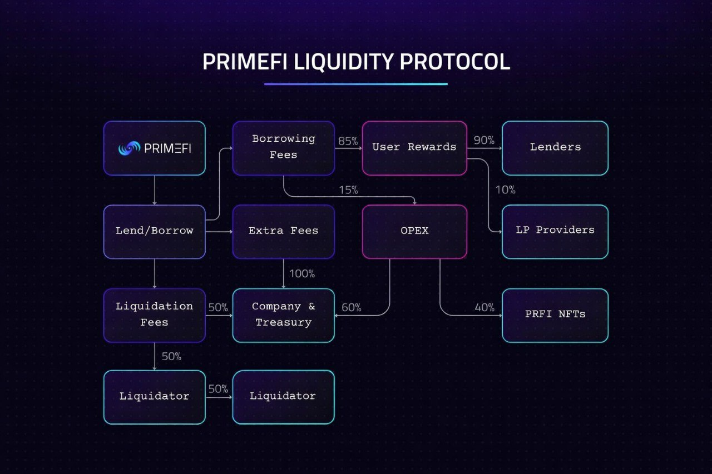

# Rewards Distribution and NFT Integration

PrimeFi includes a live PRFI NFT staking program in which qualifying participants stake PRFI through Prime Numbers NFTs under the currently configured staking rules.

A separate future concept has been described as allocating 40% of PrimeFi lending-and-borrowing protocol profits to qualifying PRFI NFT participants. That revenue-share component is **planned and not documented as an active on-chain distribution**.


Do not treat the planned percentage as a current entitlement or yield. Before activation, PrimeFi must publish the definition of profits, exclusions, eligibility, distribution period, responsible contract, and verifiable on-chain configuration.


<figure><figcaption></figcaption></figure>


PRFI NFT staking is live and is separate from using an NFT as lending collateral. NFT-as-lending-collateral and related lending-market integration remain planned features and should not be treated as currently available unless a current deployment notice and the live app explicitly show otherwise.

